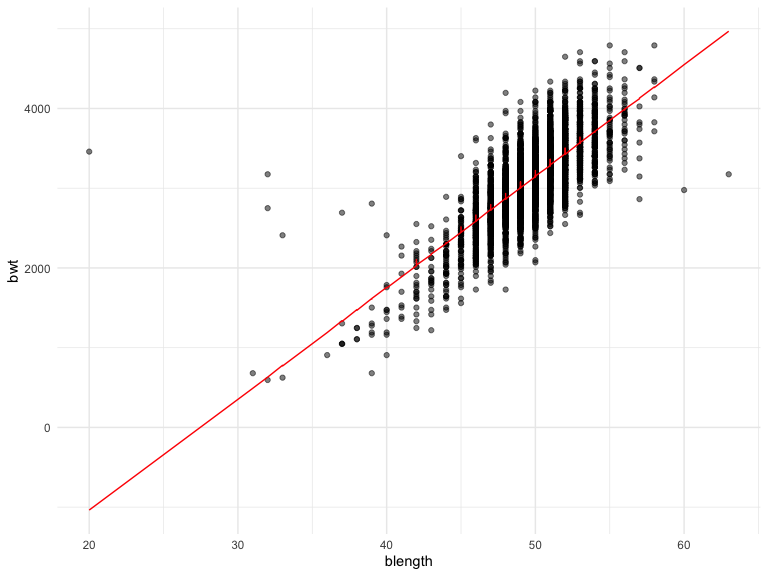

p8105_hw6_yy3421
================

## Problem 1

``` r
homicide_df = 
  read_csv("data/homicide-data.csv", na = c("", "NA", "Unknown"))  |> 
  mutate(
    city_state = str_c(city, state, sep = ", "),
    victim_age = as.numeric(victim_age),
    resolution = case_when(
      disposition == "Closed without arrest" ~ 0,
      disposition == "Open/No arrest"        ~ 0,
      disposition == "Closed by arrest"      ~ 1)
  ) |> 
  filter(victim_race %in% c("White", "Black")) |> 
  filter(!(city_state %in% c( "Dallas, TX", "Phoenix, AZ", "Kansas City, MO", "Tulsa, AL"))) |> 
  select(city_state, resolution, victim_age, victim_sex, victim_race)
```

    ## Rows: 52179 Columns: 12
    ## ── Column specification ────────────────────────────────────────────────────────
    ## Delimiter: ","
    ## chr (8): uid, victim_last, victim_first, victim_race, victim_sex, city, stat...
    ## dbl (4): reported_date, victim_age, lat, lon
    ## 
    ## ℹ Use `spec()` to retrieve the full column specification for this data.
    ## ℹ Specify the column types or set `show_col_types = FALSE` to quiet this message.

``` r
baltimore_glm = 
  filter(homicide_df, city_state == "Baltimore, MD") |> 
  glm(resolution ~ victim_age + victim_sex + victim_race, family = binomial(), data = _)

baltimore_glm |> 
  broom::tidy() |> 
  mutate(
    OR = exp(estimate), 
    OR_CI_upper = exp(estimate + 1.96 * std.error),
    OR_CI_lower = exp(estimate - 1.96 * std.error)) |> 
  filter(term == "victim_sexMale") |> 
  select(OR, OR_CI_lower, OR_CI_upper) |>
  knitr::kable(digits = 3)
```

|    OR | OR_CI_lower | OR_CI_upper |
|------:|------------:|------------:|
| 0.426 |       0.325 |       0.558 |

``` r
model_results = 
  homicide_df |> 
  nest(data = -city_state) |> 
  mutate(
    models = map(data, \(df) glm(resolution ~ victim_age + victim_sex + victim_race, 
                             family = binomial(), data = df)),
    tidy_models = map(models, broom::tidy)) |> 
  select(-models, -data) |> 
  unnest(cols = tidy_models) |> 
  mutate(
    OR = exp(estimate), 
    OR_CI_upper = exp(estimate + 1.96 * std.error),
    OR_CI_lower = exp(estimate - 1.96 * std.error)) |> 
  filter(term == "victim_sexMale") |> 
  select(city_state, OR, OR_CI_lower, OR_CI_upper)

model_results |>
  slice(1:5) |> 
  knitr::kable(digits = 3)
```

| city_state      |    OR | OR_CI_lower | OR_CI_upper |
|:----------------|------:|------------:|------------:|
| Albuquerque, NM | 1.767 |       0.831 |       3.761 |
| Atlanta, GA     | 1.000 |       0.684 |       1.463 |
| Baltimore, MD   | 0.426 |       0.325 |       0.558 |
| Baton Rouge, LA | 0.381 |       0.209 |       0.695 |
| Birmingham, AL  | 0.870 |       0.574 |       1.318 |

## Problem 2

``` r
weather_df = 
  rnoaa::meteo_pull_monitors(
    c("USW00094728"),
    var = c("PRCP", "TMIN", "TMAX"), 
    date_min = "2022-01-01",
    date_max = "2022-12-31") |>
  mutate(
    name = recode(id, USW00094728 = "CentralPark_NY"),
    tmin = tmin / 10,
    tmax = tmax / 10) |>
  select(name, id, everything())
```

    ## using cached file: /Users/yyl/Library/Caches/org.R-project.R/R/rnoaa/noaa_ghcnd/USW00094728.dly

    ## date created (size, mb): 2023-09-28 10:20:08.386959 (8.524)

    ## file min/max dates: 1869-01-01 / 2023-09-30

``` r
boot_sample = function(df) {
  
  sample_frac(df, replace = TRUE)
  
}
```

``` r
boot_straps = 
  tibble(strap_number = 1:5000) |> 
  mutate(
    strap_sample = map(strap_number, \(i) boot_sample(weather_df))
  )

boot_results_1 = 
  boot_straps |> 
  mutate(
    models = map(strap_sample, \(df) lm(tmax ~ tmin + prcp, data = df)),
    results_1 = map(models, broom::glance)
  ) |> 
  select(strap_number, results_1) |> 
  unnest(results_1) |> 
  select(strap_number, r.squared)

boot_results_2 = 
  boot_straps |> 
  mutate(
    models = map(strap_sample, \(df) lm(tmax ~ tmin + prcp, data = df)),
    results_2 = map(models, broom::tidy),
    results_2 = map(results_2, as_tibble)
  ) |> 
  select(strap_number, results_2) |> 
  unnest(results_2) |>
  select(-std.error,-statistic, -p.value) |> 
  pivot_wider(
    names_from = term,
    values_from = estimate
  )

boot_results = 
  left_join(boot_results_1, boot_results_2, by = "strap_number") |> 
  janitor::clean_names() |> 
  rename(beta_zero = intercept,
         beta_one = tmin,
         beta_two = prcp) |> 
  mutate(
    logbeta01 = log(beta_zero * beta_one),
    logbeta12 = log(abs(beta_one * beta_two))
  )
```

### Plot the distribution

``` r
boot_results |> 
  ggplot(aes(x = r_squared))+
  geom_density()
```


``` r
boot_results |> 
  ggplot(aes(x = logbeta12))+
  geom_density()
```


\###2.5% and 97.5% quantiles to provide a 95% confidence interval for r̂
2and beta01

``` r
boot_results |> 
  summarize(
    ci_lower_r = quantile(r_squared, 0.025),
    ci_upper_r = quantile(r_squared, 0.975),
    ci_lower_beta01 = quantile(logbeta01, 0.025),
    ci_upper_beta01 = quantile(logbeta01, 0.975)
  )
```

    ## # A tibble: 1 × 4
    ##   ci_lower_r ci_upper_r ci_lower_beta01 ci_upper_beta01
    ##        <dbl>      <dbl>           <dbl>           <dbl>
    ## 1      0.888      0.940            2.06            2.14

## Problem 3

``` r
birthweight_df = 
  read_csv(
    "data/birthweight.csv", na = c("", "NA", "Unknown")
    ) |> 
  mutate(
    babysex = case_match(
      babysex, 
      1 ~ "male",
      2 ~ "female"
    ),
    babysex = as.factor(babysex),
    malform = case_match(
      malform, 
      0 ~ "absent",
      1 ~ "present"
    ),
    malform = as.factor(malform)
  ) |> 
  select(bwt, blength, bhead, gaweeks, babysex, malform)
```

    ## Rows: 4342 Columns: 20
    ## ── Column specification ────────────────────────────────────────────────────────
    ## Delimiter: ","
    ## dbl (20): babysex, bhead, blength, bwt, delwt, fincome, frace, gaweeks, malf...
    ## 
    ## ℹ Use `spec()` to retrieve the full column specification for this data.
    ## ℹ Specify the column types or set `show_col_types = FALSE` to quiet this message.

### Propose a linear regression model

``` r
linear_mod_1 = lm(bwt ~ blength + babysex + malform, data = birthweight_df)
```

``` r
birthweight_df |> 
  modelr::add_predictions(linear_mod_1) |> 
  modelr::add_residuals(linear_mod_1) |> 
  ggplot(aes(x = malform, y = resid)) + geom_violin() 
```


``` r
birthweight_df |> 
  modelr::add_predictions(linear_mod_1) |> 
  modelr::add_residuals(linear_mod_1) |> 
  ggplot(aes(x = blength, y = bwt)) + 
  geom_point(alpha = .5)+
  geom_line(aes(y = pred), color = "red")
```



### One using length at birth and gestational age as predictors (main effects only)

``` r
linear_mod_2 = 
  lm(bwt ~ blength + gaweeks, data = birthweight_df) 
```

\###One using head circumference, length, sex, and all interactions
(including the three-way interaction) between these

``` r
linear_mod_3 = 
  lm(bwt ~ bhead* blength + bhead* babysex+ bhead*blength*babysex, data = birthweight_df) 
```

``` r
birthweight_df |> 
  gather_predictions(linear_mod_1, linear_mod_2, linear_mod_3) |> 
  mutate(model = fct_inorder(model)) |> 
  ggplot(aes(x = blength, y = bwt)) + 
  geom_point(alpha = .5) +
  geom_line(aes(y = pred), color = "red") + 
  facet_grid(~model)
```


``` r
cv_df =
  crossv_mc(birthweight_df, 100) |> 
  mutate(
    train = map(train, as_tibble),
    test = map(test, as_tibble))
```

``` r
cv_df = 
  cv_df |> 
  mutate(
    mod_1 = map(train, \(df) lm(bwt ~ blength + babysex + malform + bhead*blength*babysex, data = df)),
    mod_2 = map(train, \(df) lm(bwt ~ blength + gaweeks, data = df)),
    mod_3  = map(train, \(df) lm(bwt ~ bhead* blength + bhead* babysex+ bhead*blength*babysex, data = df))
    ) |> 
  mutate(
    rmse_1 = map2_dbl(mod_1, test, \(mod, df) rmse(model = mod, data = df)),
    rmse_2    = map2_dbl(mod_2, test, \(mod, df) rmse(model = mod, data = df)),
    rmse_3 = map2_dbl(mod_3, test, \(mod, df) rmse(model = mod, data = df)))
```

``` r
cv_df |> 
  select(starts_with("rmse")) |> 
  pivot_longer(
    everything(),
    names_to = "model", 
    values_to = "rmse",
    names_prefix = "rmse_") |> 
  mutate(model = fct_inorder(model)) |> 
  ggplot(aes(x = model, y = rmse)) + geom_violin()
```


